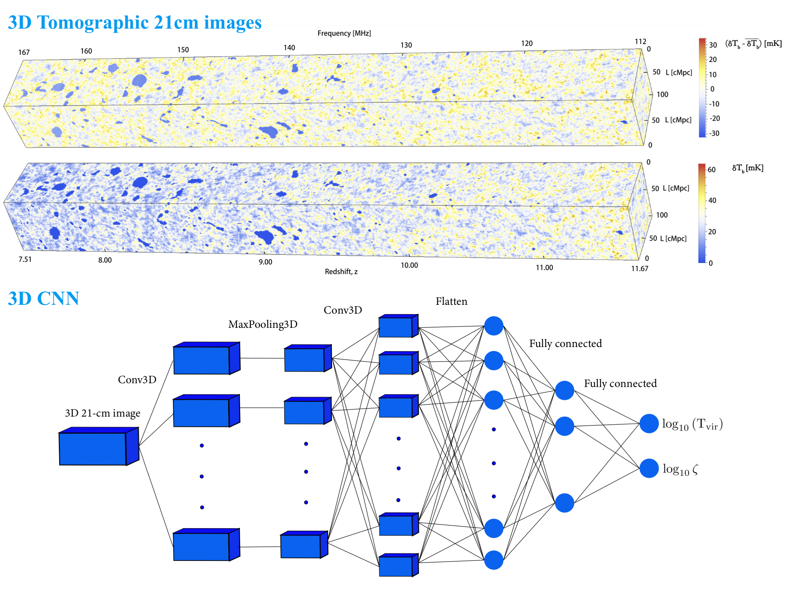

# DELFI-3DCNN
This is for the project: Reionization Parameter Estimation Using Three-dimensional Tomographic 21 cm Images with Deep Learning. The methods are described in detail in [Zhao et al. 2022](https://arxiv.org/abs/2105.03344). In this repository, we present the code for training the 3DCNN both with Tensorflow and Pytorch. The trained 3DCNN could be incorporated into the [pydelfi](https://github.com/justinalsing/pydelfi) package to perform the Bayesian inference. 

